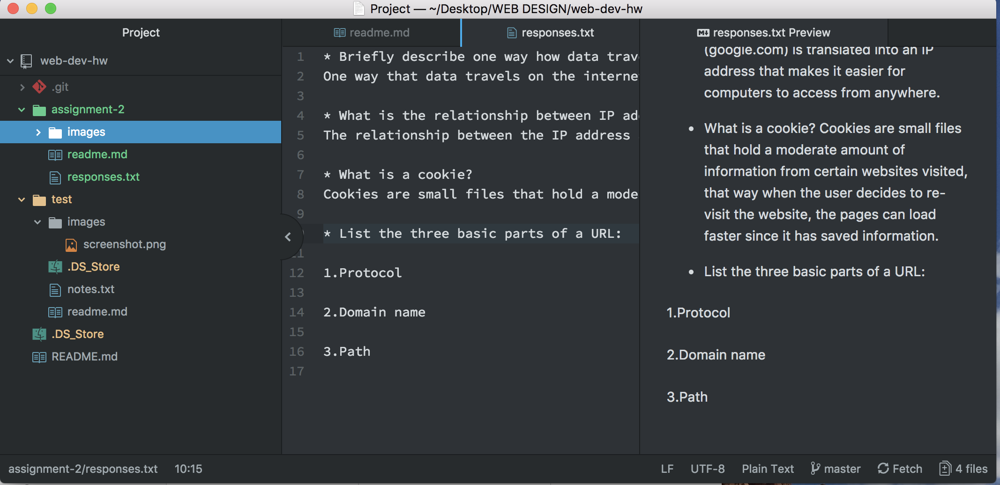

# Assignment 2

A Version control system or VCS, is how developers are able to track changes that they make to a file over time. It also allows the writer to go back to a previous version of thier project if something they did didn't work. VCS is also great in that it helps with collaboration as well. These are some of the main reasons why we are using this system. By using VCS we are able to check our progress on submitting changes, saving updates, and organizing group projects. The collaboration aspect is a huge tool that will allow us to work on group projects and see changes people make, when they made thier changes, and what happened when they made them.

Take a look at my [responses](./responses.txt]) pertaining to internet protocol and systems.

This assignment challenged me to become nitpicky with folders, naming and placement. By being organized and understanding the concepts behind the value of VCS and how using repositories are extrmeely helpful for building a project. I didn't have any problems or issues, the instructions were straight forward and makes sense when running through everything step by step. The screenshots that were associated with each step on the site were very helpful as well. I learned how much easier it is for people to work on things together with VCS and I wonder if there are any other types of examples of VCS in other fields.

