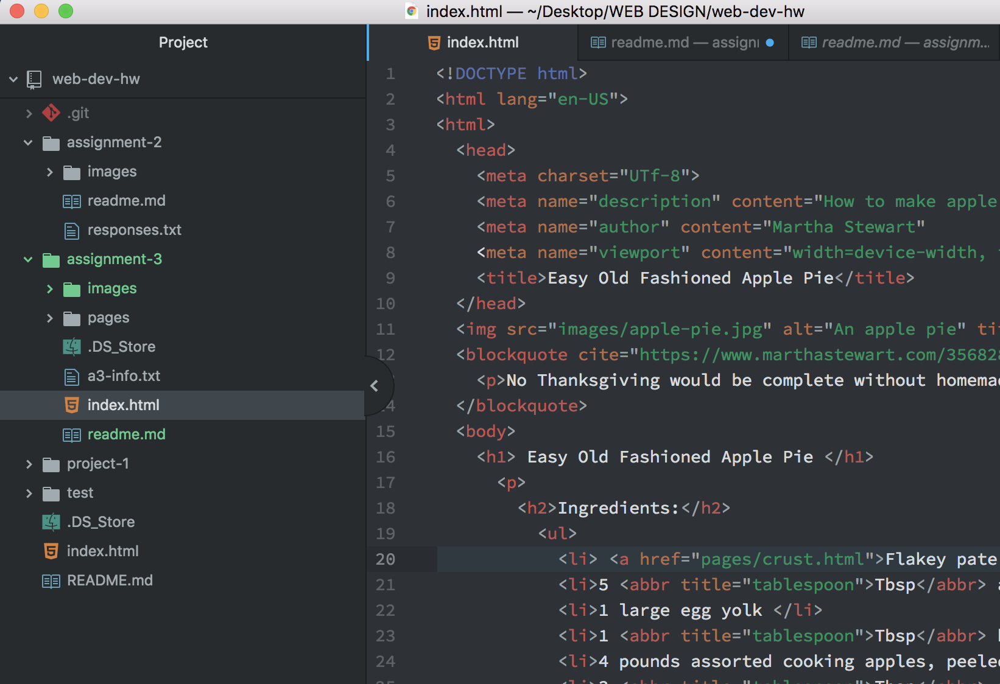

<h1>Assignment 3 Report</h1>
B. There can only be 1 "head" and "body" element to a page. The head is at the beginning and describes the information about the page, while the body is what will be shown on the main browser window.  
C. The difference betweeen structural and semantic markup is that structural markup is code that affects the flow of the page while semantic markup is code that places emphasis on elements (ex. bold, italics, abbr, etc.).  
D. The work I did for this cycle was initially difficult and hard to understand. But going through the directions and reviewing the textbook was extremely helpful. I structured it by indenting with each line of added elements, so that it was easier to see what I closed and what I did not. The only issues that arose when doing this assignment was the linking of the pages and image source. But after moving some files around in the assignment folder and correcting the location I was able to fix it. Something I really enjoyed about this assignment was how there were the multiple pages and links that we created that allowed us to navigate back and forth between the pages. I feel like with this application I'm starting to understand the concepts around web pages more, and additionally respect the process that these developers have to go through with making a website. With the problems I went through I did not post to the repo because I ended up figuring them out on my own through the textbook and website.

