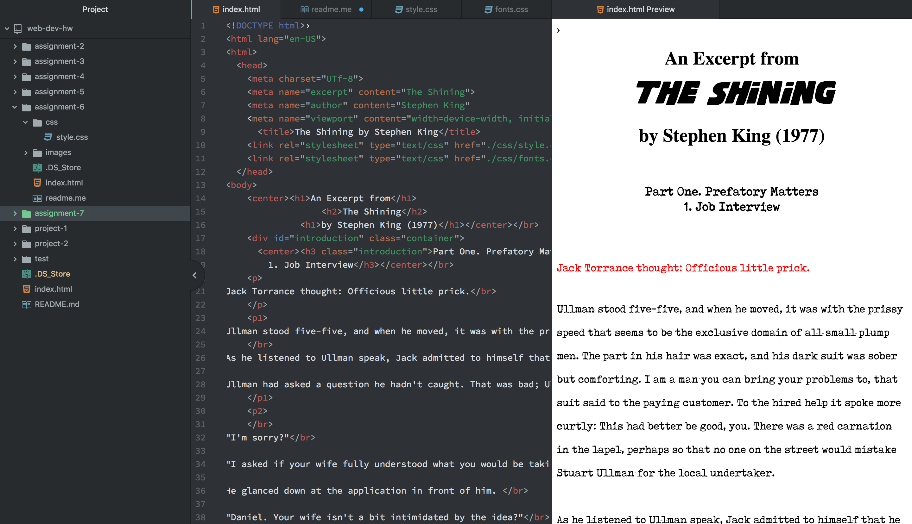

# Assignment 7 Repo

    I personally really enjoy the movie "The Shining".
  So when I chose the fonts "shining nfi demo" and "tox typewriter"
  for this assignment, I really geared it towards the movie. The first
  font was the original font that they had used for the movie poster
  and I thought it would look really cool to pay homage towards Stephen taking
  by using the original font. Now because the character Jack Torrance is a writer
  in this book/movie, I thought it would be best to put the excerpt in a Typewriter
  font.
  Fall back fonts or font stack is important because not every computer will
  have the same font that you used. Therefore you can use fall back fonts or font
  stack to incorporate a new font for the user so that there is less loading time
  and the original font isn't replaced by some font that doesn't look close
  to the original font that you had. A desktop font is specifically designed
  to be downloaded onto your computer for use on different apps. A webfont is
  specifically used for fonts use on websites using the @fontface. A websafe font
  is a font that is preinstalled onto your computer.
  This assignment was a lot of fun to work on. After finding out which fonts
  I wanted to use it was really easy to put together. I struggled initially
  with linking the pages again, but I realized that it was just something
  I did wrong with the fonts folder that made things difficult. But aside from
  that it was easy to use the directions, website, and textbook for any other
  help along the way.

