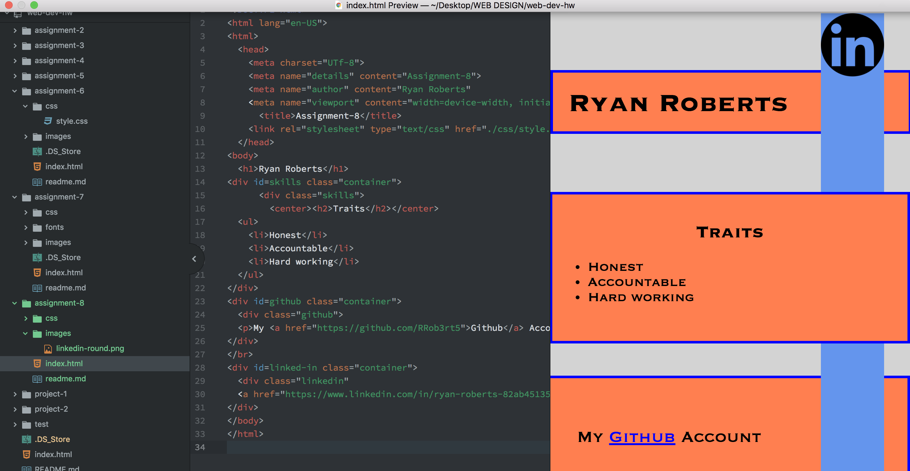

# Assignment 8 Repo
The difference between padding margin and borders is that padding is the amount of space between what's inside the element and the element itself. Margins are the space between the box or element and other elements. Finally, borders are lines that separate the content of the element from other elements and keep them contained; it makes the content look more organized and neater.

The most difficult task for me initially was positioning the elements. Trying to understand what each meant and how I wanted to organize the information. But after some trial and conceptual review it made more sense and I was able to create the product I have now.

I didn't have too much trouble initially with this assignment, the directions and help on the website were very useful and made a lot of sense. The hardest part was figuring out a way to lay out all of the information. And I thought I had it figured out, until I went on to the brower live site to view it and the image was all distorted and didn't look anything that I intended it to look like from the preview. So after constant trial and error I chose a different type of position setting and edited the website so that it was able to look good and work on different browsers. Unfortunately it doesn't look like what I had intended it to look like but in the end I was still able to apply the techniques and make something out of it.

