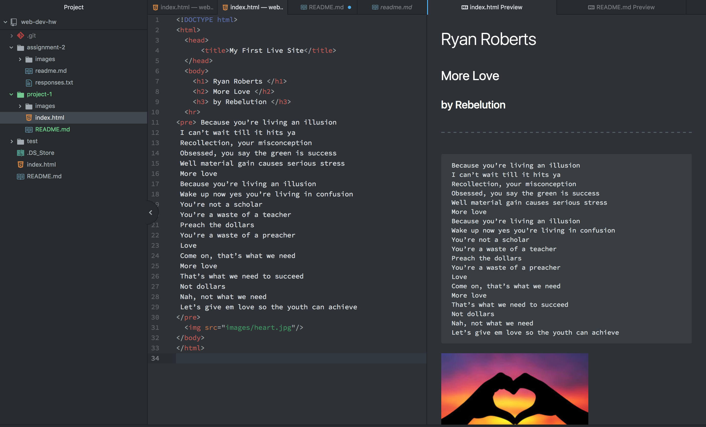

# Project 1: My First Live Site Repo
## Ryan Roberts
* List some of the browsers you use and briefly describe how a browser functions: 
Some of the main browsers that I use when surfing the web and when developing are Safari (when I use my mac and phone), Google Chrome, and Mozilla Firefox (when I'm at work). A browser functions by pulling the source you are looking for from the server and displaying it on your webpage. The source is normally an HTML file, and the way it displays on the webpage is based on the HTML and CSS specifications.  

* Describe your experience with the Wayback machine:  
I went to the ESPN webpage from 1999 to compare to the 2018 webpage. ESPN from 1999 was more bland in terms of color scheme and creativity. There wasn't much variety in terms of links to click on to view different sports, and there were less interactive news articels to read and scroll through versus the 2018 version. In the 2018 version, there are live updates on scores with different sports happening real time and the organization is much easier to follow and find what you came to look for. It is pretty incredible to see how big of a positive change webpages have come in 19yrs, especially when it comes to sports.

* Work Cycle:
This assignment challenged me to really pay attention to detail when it comes to developing. Any small mistake or extra space could throw off everything when trying to upload an image or a link. Once again the insructions were very clear and I had a great time putting this first project together, It's really rewarding to see the final image when you copy the html into Google.

