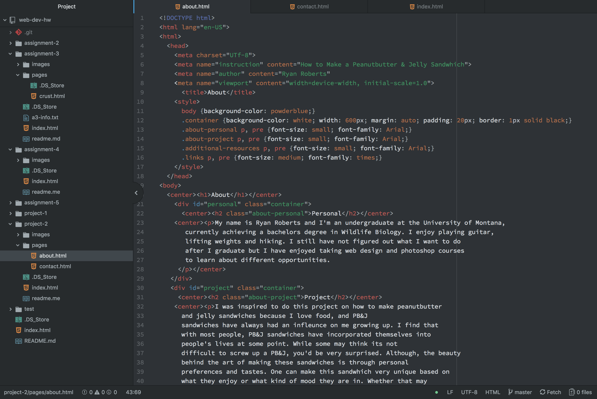

# Project 2 Report

      My experience with HTML has been very smooth and very rewarding, I find that the concepts
    learned throughout these lessons have been very useful and interesting to learn. I had never
    worked with HTML before so this was all new and exciting to learn.
      I am very excited about learning how to make the webpages more appealing and
    eye catching in the future. To know that CSS and HTML work seamlessly together
    makes me very intrigued to see what lies ahead.
      The work for this project was very time consuming and detail oriented. Attention was
    very important in this project to make sure that everything ran smoothly and connected together.
    I didn't run into any big problems working on this project and if I got stuck I would just
    refer myself with the website and textbook. I think this is the best webpage I've made in this
    course and I look forward to learning CSS later.

